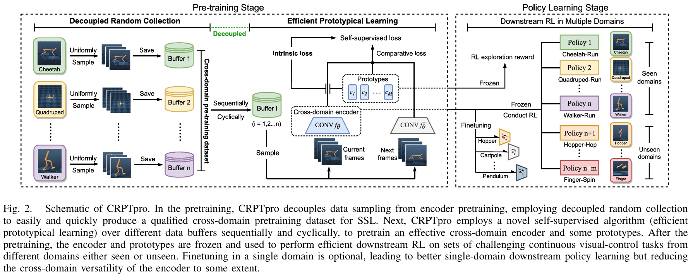

# Cross-Domain Random Pretraining With Prototype for Reinforcement Learning




## Instruction

Enter the repository and use conda to create a environment.
```
cd CRPTpro

conda env create -f conda_env.yml
```

Use tmux to create a terminal (optional):
```
tmux
```

Then enter the created conda environment:

```
conda activate CRPTpro
```


Run the experiments. The data collection, pre-training, and downstream RL are all included.

```
python train.py
```


## Citation


```
@ARTICLE{10908358,
  author={Liu, Xin and Chen, Yaran and Li, Haoran and Li, Boyu and Zhao, Dongbin},
  journal={IEEE Transactions on Systems, Man, and Cybernetics: Systems}, 
  title={Cross-Domain Random Pretraining With Prototypes for Reinforcement Learning}, 
  year={2025},
  volume={55},
  number={5},
  pages={3601-3613},
  keywords={Visualization;Prototypes;Training;Data collection;Space exploration;Representation learning;Reinforcement learning;Robots;Electronic mail;Automation;Cross-domain representation;deep reinforcement learning (DRL);random policy;RL visual pretraining;self-supervised learning (SSL);unsupervised exploration},
  doi={10.1109/TSMC.2025.3541926}}
```
